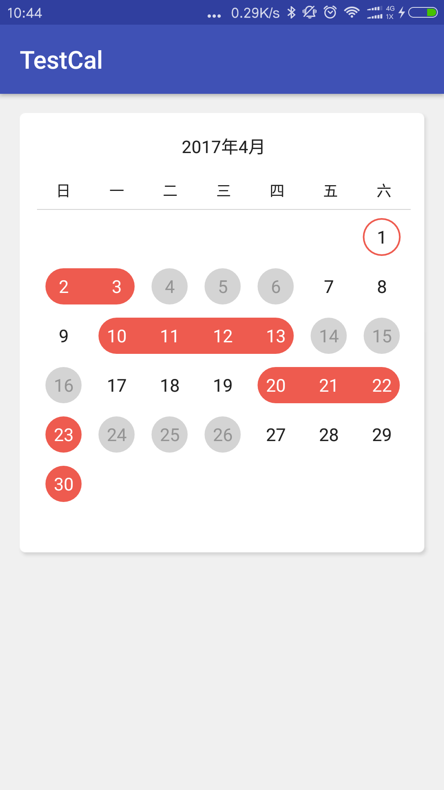
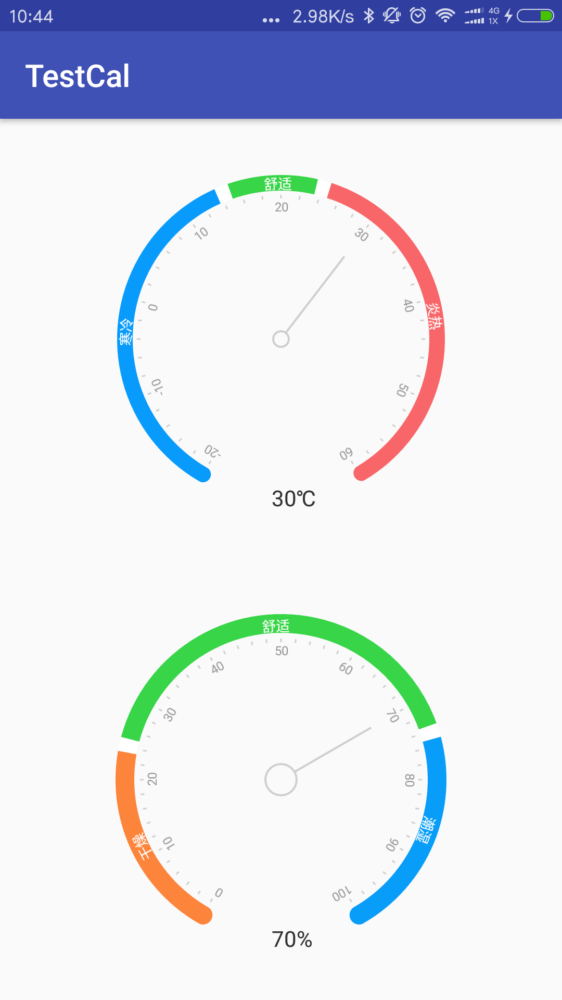
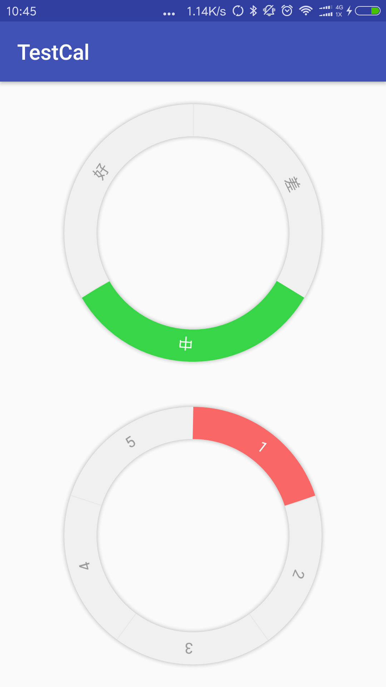

CalendarView
============

#包含三个自定义View 日历仪表盘 圆盘
---------------------------------------

### 日历 支持翻页，点击日期，日期状态 ###

### 仪表盘 可根据配置改变圆弧，设置字体颜色和配置颜色，指针大小，字体大小打开动画等 ###

### 圆盘 可根据配置改变个数，支持点击单个圆弧回调，设置字体和配置颜色,分割线，阴影打开动画等 ###

