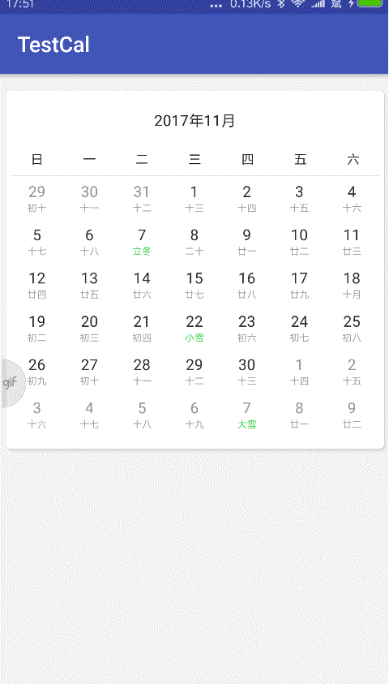

CalendarView
============

#####  包含三个自定义View 日历仪表盘 圆盘
---------------------------------------
> 这是使用RecyclerView做的日历，比之前ViewPager不管从逻辑，功能更加强大，实现更加简单。之前ViewPager的日历没有功能逻辑分离，这次提供全新IDrawFormat接口，比如你需要针对某些日期增加标签，你就可以实现IDrawFormat,然后addDrawFormat就可以了，这样就实现标签和其他逻辑混合导致逻辑混乱，按顺序多层绘制，默认只提供文字层（日历日期和农历），但也需要自己add。你可以设置先后顺序，完美实现所有功能。可以支持任何样式。当前前提你会一点Android canvas绘制。月模式也完成，以后会提供小米日历类似功能。

##### 日历 支持翻页，点击日期，日期状态 ###

##### 仪表盘 可根据配置改变圆弧，设置字体颜色和配置颜色，指针大小，字体大小打开动画等 ###

##### 圆盘 可根据配置改变个数，支持点击单个圆弧回调，设置字体和配置颜色,分割线，阴影打开动画等 ###

